# 🚀 Fraud Detection AI API

AI-powered fraud analysis service using Groq + RAG + Streaming.

---

## 📌 Overview

This service provides:

- Fraud risk analysis
- AI-based recommendations
- Batch processing
- Async report generation
- RAG-based contextual answers
- Real-time streaming (SSE)
- Redis caching with fallback

---

## ⚙️ Tech Stack

- Flask (Backend)
- Groq LLM (AI)
- ChromaDB (Vector DB)
- Sentence Transformers (Embeddings)
- Redis (Caching)
- SSE (Streaming)

---

## 📁 Project Structure

```
ai-service/
├── app.py
├── routes/
├── services/
├── prompts/
├── tests/
├── requirements.txt
└── README.md
```

---

# 📡 API Documentation — Fraud Detection AI

## 🔍 Interactive API Explorer

The image below shows the **live Swagger UI** of the deployed Fraud Detection AI service.
It provides a complete overview of all available endpoints and allows real-time testing of requests and responses.

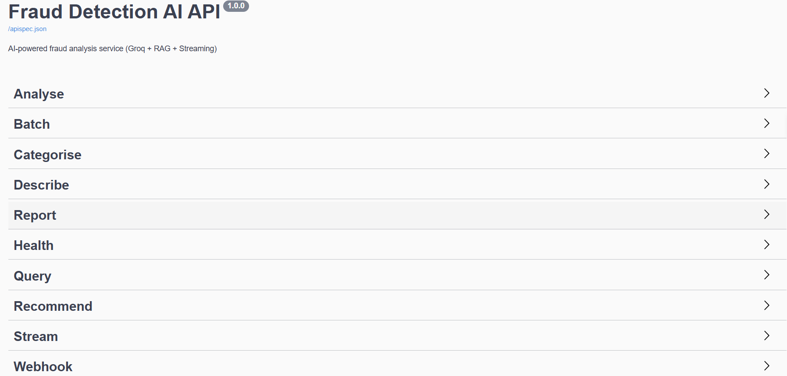

### 💡 What this includes:

- 📊 **Analyse** — Fraud risk detection using AI
- 📦 **Batch** — Process multiple fraud inputs
- 🏷 **Categorise** — Classify fraud type
- 🧠 **Describe** — Detailed fraud reasoning
- 📄 **Report** — Async report generation
- ⚡ **Stream** — Real-time SSE report streaming
- 🔎 **Query** — RAG-based contextual answers
- 🛡 **Recommend** — Prevention actions
- ❤️ **Health** — System monitoring
- 🔔 **Webhook** — Async callbacks

This interface is used for:

- Testing APIs during development
- Validating request/response formats
- Demonstrating system capabilities in real-time

---

## 🔌 API Endpoints

### 🟢 Analyse

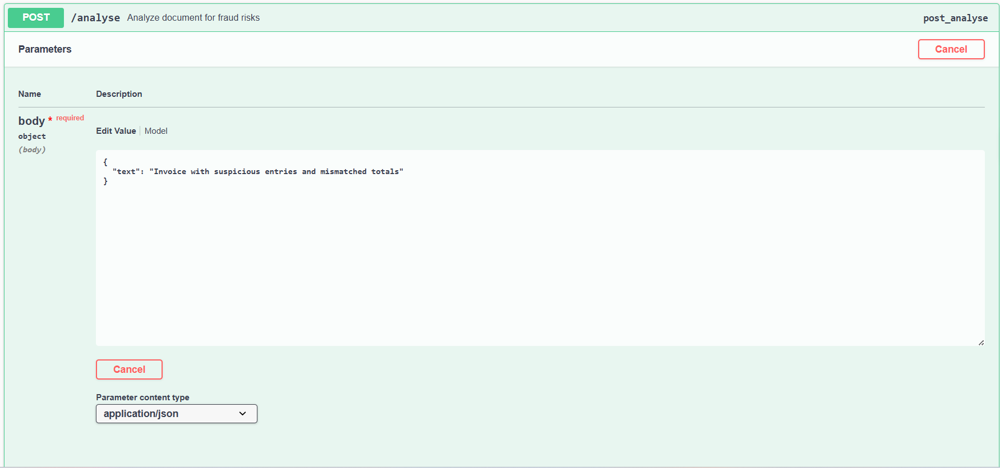
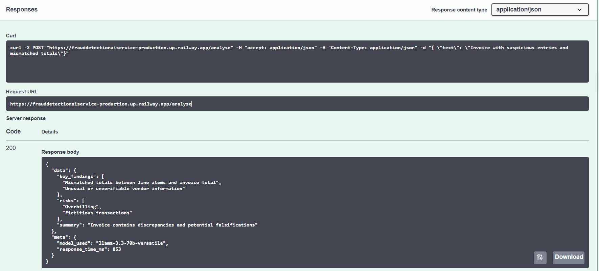

---

### 🟢 Batch

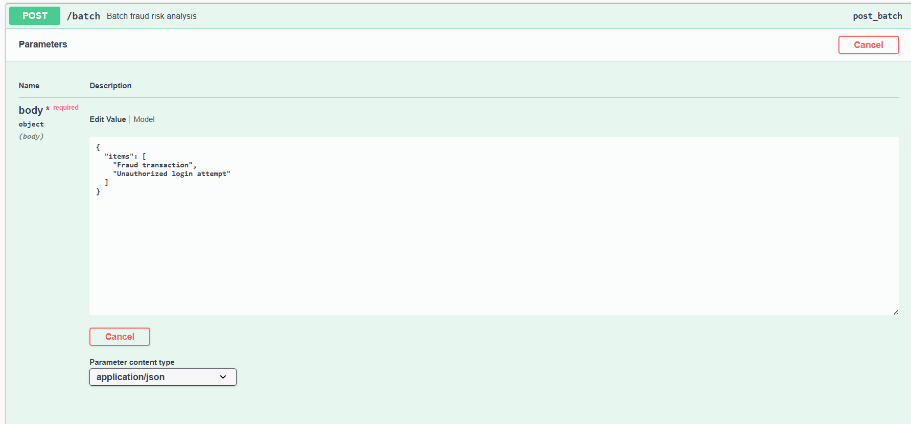
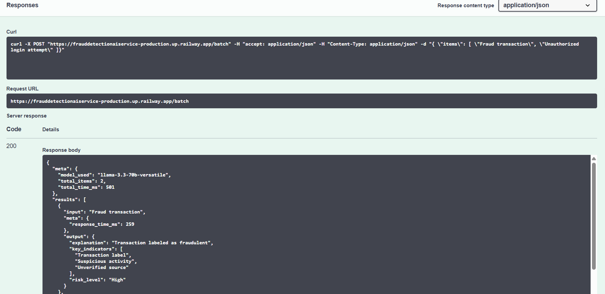

---

### 🟢 Categorise

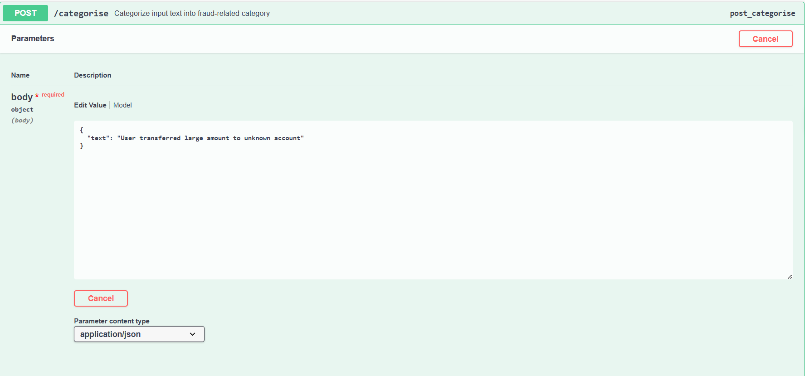
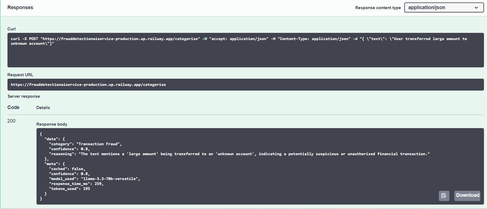

---

### 🟢 Describe

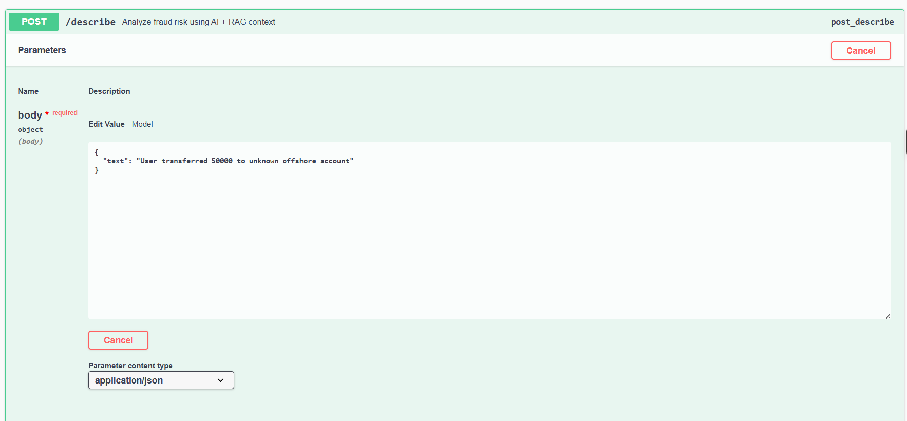
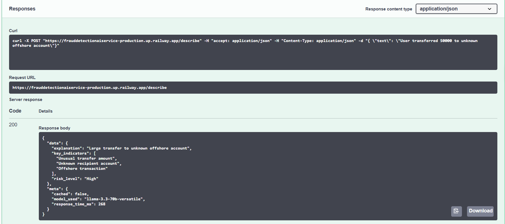

---

### 🟢 Generate Report

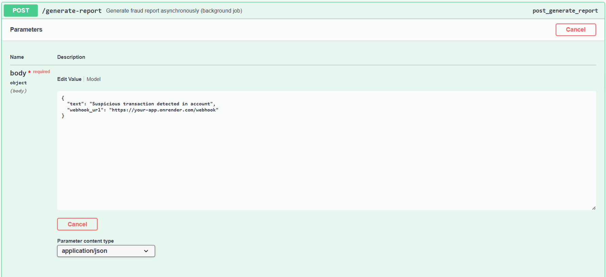
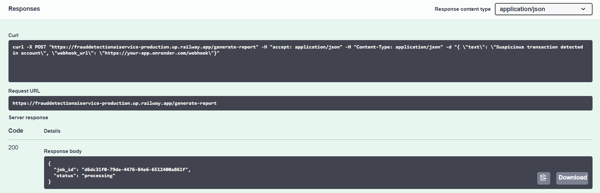

---

### 🟢 Job Status

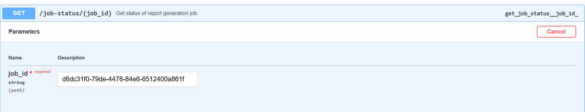
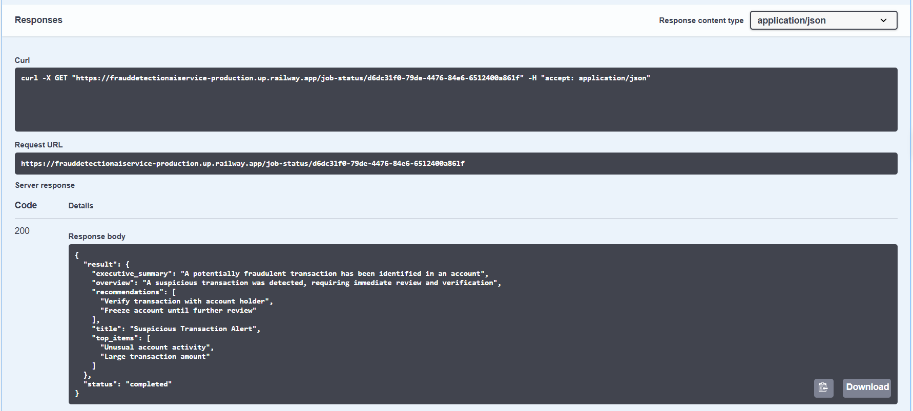

---

### 🟢 Health

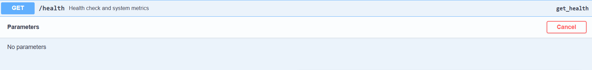
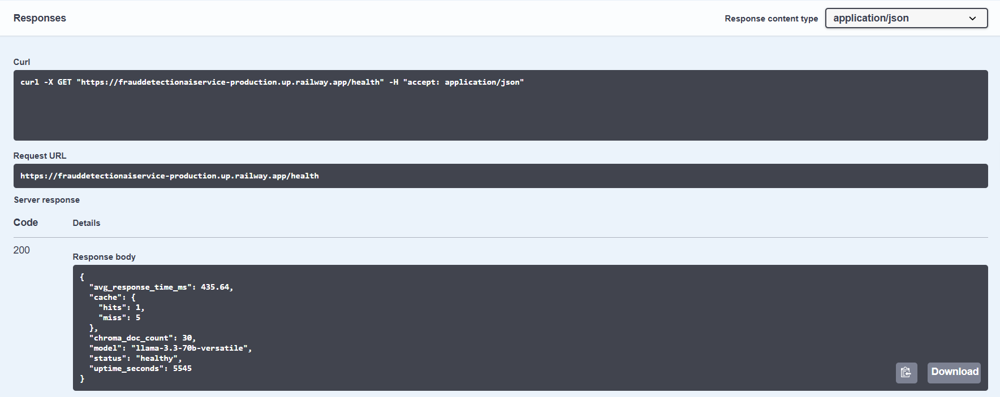

---

### 🟢 Query (RAG)

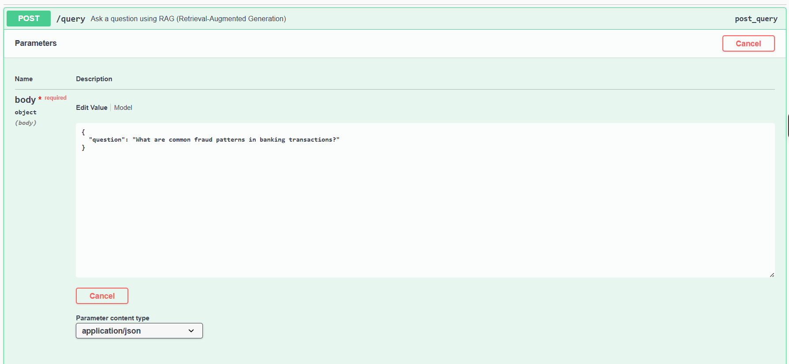
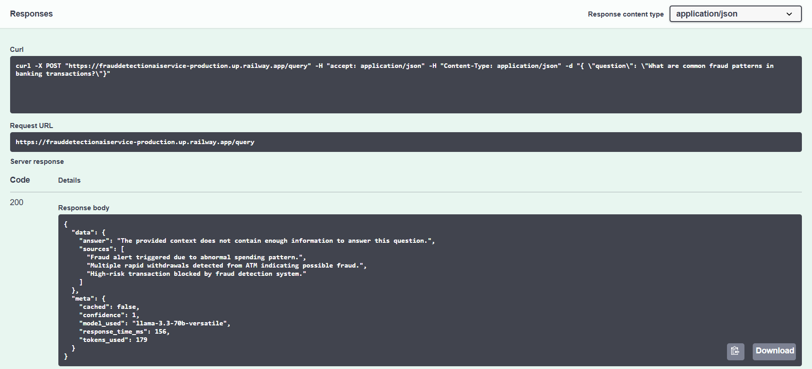

---

### 🟢 Recommend

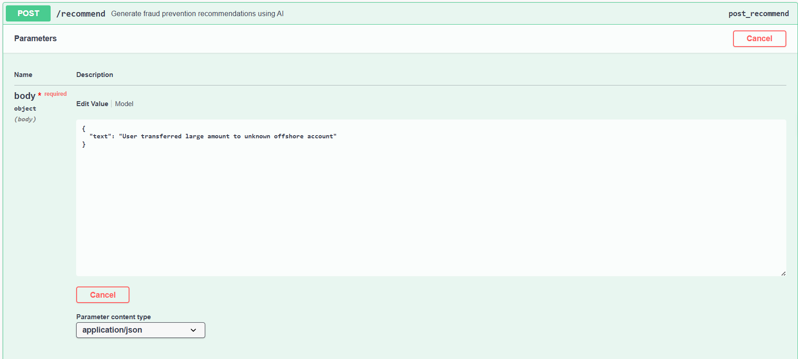
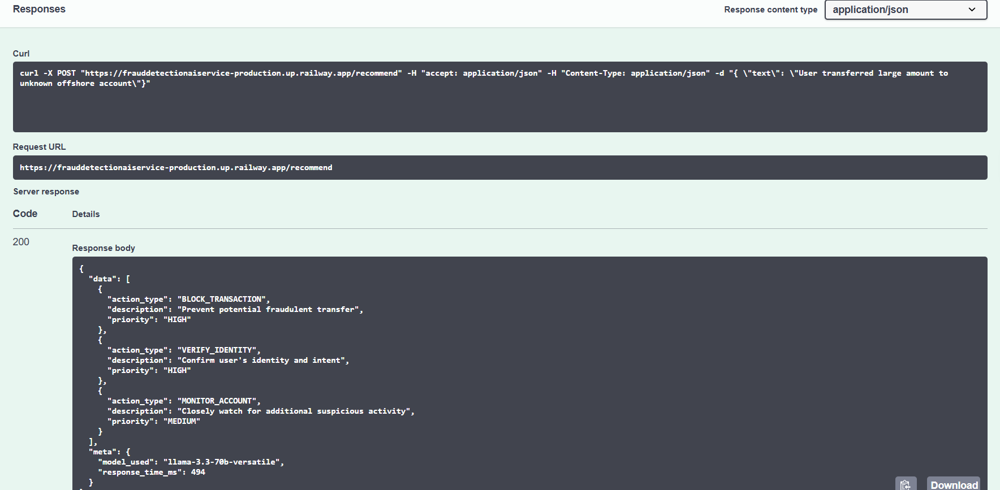

---

### 🟢 Report Stream (SSE)

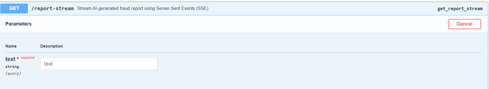
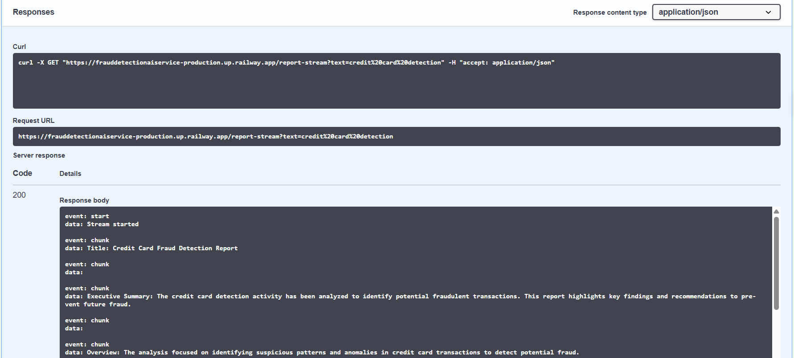

---

### 🟢 Webhook

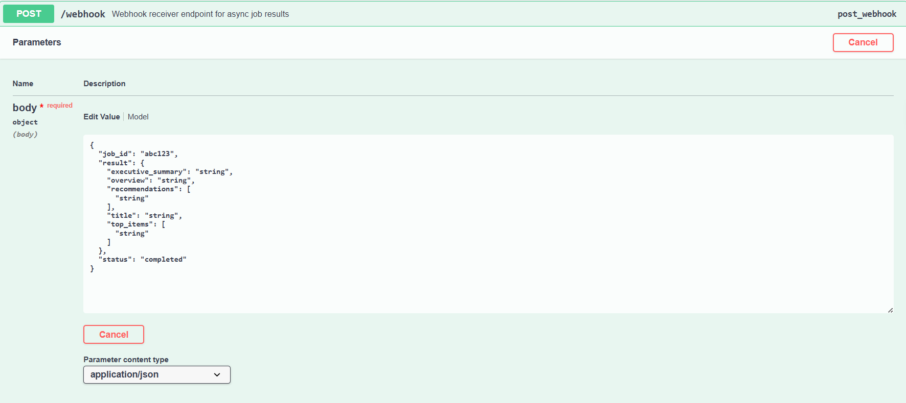
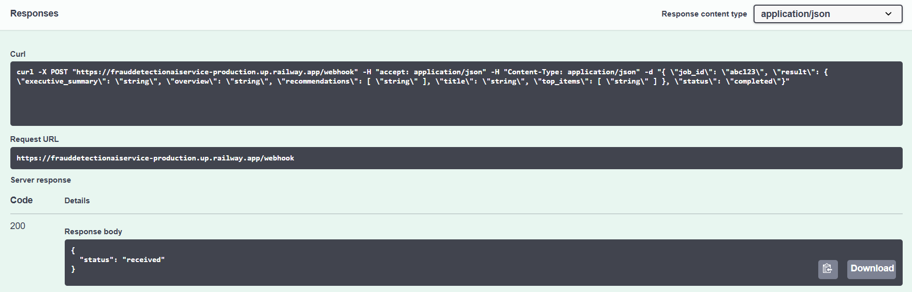

---

## ⚡ Features

- ⚡ Fast AI responses using Groq
- 📊 Structured JSON outputs
- 🔁 Redis caching for performance
- 📡 Streaming support (SSE)
- 🧠 RAG for contextual intelligence
- 🔒 Secure environment configuration

---

## 🚀 Run Locally

```bash
pip install -r requirements.txt
python app.py
```

---

## 🧪 Testing

```bash
pytest
```

---

## 📈 Performance

- p50, p95, p99 latency tested
- Redis cache hit/miss validated
- Stable under multiple requests

---

## 👨‍💻 Authors

- AI Developer 1
- AI Developer 2

---

## 📌 Notes

- `.env` is not committed (security reasons)
- `.env.example` provided for setup
- Fully ready for Docker & Railway deployment

---
